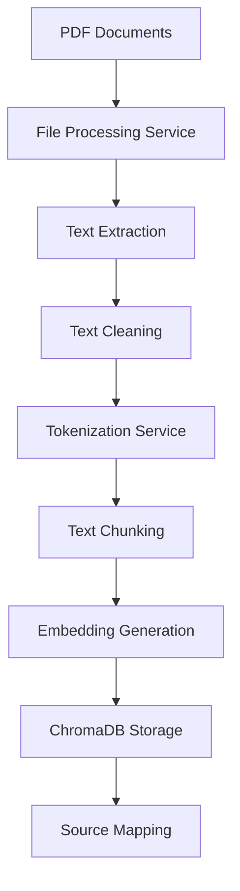
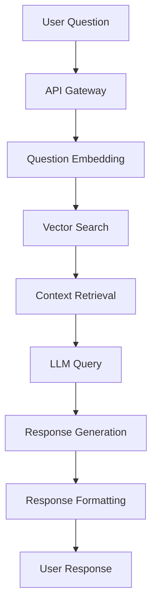

# Architecture Guide

## Overview

The RAG Chatbot API is built using a microservices architecture with clear separation of concerns. The system is designed to be scalable, maintainable, and production-ready.

## System Architecture

```
┌─────────────────────────────────────────────────────────────────┐
│                        Frontend Layer                           │
├─────────────────────────────────────────────────────────────────┤
│  HTML/JS Interface  │  Mobile App  │  Third-party Integrations  │
└─────────────────────┴──────────────┴─────────────────────────────┘
                                    │
                                    ▼
┌─────────────────────────────────────────────────────────────────┐
│                       API Gateway Layer                         │
├─────────────────────────────────────────────────────────────────┤
│  FastAPI Application  │  Authentication  │  Rate Limiting       │
│  Request Validation   │  CORS Handling   │  Error Handling      │
└─────────────────────┴────────────────────┴───────────────────────┘
                                    │
                                    ▼
┌─────────────────────────────────────────────────────────────────┐
│                      Service Layer                              │
├─────────────────────────────────────────────────────────────────┤
│  File Processing  │  Tokenization  │  LLM Querying  │  Merchant  │
│  Service          │  Service       │  Service       │  Querying  │
│                   │                │                │  Service   │
└────────────────────┴────────────────┴────────────────┴───────────┘
                                    │
                                    ▼
┌─────────────────────────────────────────────────────────────────┐
│                      Data Layer                                 │
├─────────────────────────────────────────────────────────────────┤
│  ChromaDB Vector  │  File System   │  External APIs             │
│  Database         │  Storage       │  (OpenRouter)              │
└────────────────────┴───────────────┴─────────────────────────────┘
```

## Core Components

### 1. API Gateway Layer

**FastAPI Application (`src/hr_app.py`)**
- Main entry point for all HTTP requests
- Handles routing and request/response processing
- Implements authentication and authorization
- Provides health checks and monitoring endpoints

**Key Features:**
- Automatic API documentation (OpenAPI/Swagger)
- Request validation using Pydantic models
- CORS configuration for cross-origin requests
- Rate limiting and throttling
- Comprehensive error handling

### 2. Service Layer

#### File Processing Service (`services/file_processing_service.py`)
**Purpose**: Handles document ingestion and text processing

**Responsibilities:**
- PDF to text conversion using PyMuPDF
- Text cleaning and normalization
- File format validation
- Batch processing of multiple documents

**Key Methods:**
- `pdf_to_txt()`: Convert PDF files to plain text
- `clean_text()`: Normalize and clean extracted text
- `process_files()`: Orchestrate the entire file processing pipeline

#### Tokenization Service (`services/tokenization_service.py`)
**Purpose**: Manages text chunking and embedding generation

**Responsibilities:**
- Text chunking using token-based boundaries
- Embedding generation using sentence transformers
- Source mapping for traceability
- Context preparation for LLM queries

**Key Methods:**
- `split_into_chunks_by_tokens()`: Token-based text chunking
- `generate_embeddings()`: Create embeddings for text chunks
- `embed_question()`: Generate embeddings for user questions
- `prepare_llm_context()`: Format context for LLM queries

#### LLM Querying Service (`services/llm_querying_service.py`)
**Purpose**: Interfaces with external LLM providers

**Responsibilities:**
- API communication with OpenRouter
- Prompt engineering and formatting
- Response processing and validation
- Error handling and retry logic

**Key Methods:**
- `api_call_with_context()`: Make LLM API calls with RAG context
- `format_prompt()`: Structure prompts for optimal responses
- `process_response()`: Extract and validate LLM responses

#### Merchant Querying Service (`services/merchant_querying_service.py`)
**Purpose**: Specialized service for merchant FAQ handling

**Responsibilities:**
- Merchant-specific prompt engineering
- Bengali language support
- Domain-specific response formatting
- Integration with ChromaDB for merchant data

### 3. Data Layer

#### ChromaDB Client (`lib/chromaDBClient.py`)
**Purpose**: Vector database management and operations

**Responsibilities:**
- Database connection management
- Collection creation and management
- Vector similarity search
- Data persistence and retrieval

**Key Features:**
- Singleton pattern for connection management
- Automatic collection creation
- Efficient similarity search with configurable parameters
- Source metadata tracking

#### File System Storage
**Purpose**: Persistent storage for processed documents

**Structure:**
```
Data/
├── raw_pdfs/              # Original PDF documents
├── raw_txt_files/         # Extracted text files
├── cleaned_txt_files/     # Normalized text files
├── chunks/                # Text chunks with metadata
├── embeddings/            # Generated embeddings
└── source_maps/           # Source mapping files
```

## Data Flow

### 1. Document Ingestion Flow



**Steps:**
1. **Document Upload**: PDF files are placed in the processing directory
2. **Text Extraction**: PyMuPDF extracts text content from PDFs
3. **Text Cleaning**: Remove formatting artifacts and normalize text
4. **Chunking**: Split text into token-bounded chunks with overlap
5. **Embedding**: Generate vector embeddings for each chunk
6. **Storage**: Store chunks and embeddings in ChromaDB
7. **Mapping**: Create source mapping for traceability

### 2. Query Processing Flow



**Steps:**
1. **Question Reception**: API receives user question
2. **Embedding**: Generate embedding for the question
3. **Vector Search**: Find similar chunks in ChromaDB
4. **Context Assembly**: Prepare context from retrieved chunks
5. **LLM Query**: Send context + question to OpenRouter
6. **Response Processing**: Extract and validate LLM response
7. **Formatting**: Add metadata and format response
8. **Delivery**: Return formatted response to user

## Technology Stack

### Backend Framework
- **FastAPI**: Modern, fast web framework for building APIs
- **Uvicorn**: ASGI server for production deployment
- **Gunicorn**: WSGI server for production environments

### AI/ML Libraries
- **Sentence Transformers**: Text embedding generation
- **Transformers**: Tokenization and model management
- **PyTorch**: Deep learning framework for embeddings
- **ChromaDB**: Vector database for similarity search

### Document Processing
- **PyMuPDF**: PDF text extraction and processing
- **Pillow**: Image processing for OCR
- **pytesseract**: OCR for image-based text extraction

### External Services
- **OpenRouter**: LLM API provider (GPT-4, Claude, etc.)
- **ChromaDB**: Vector database for embeddings

## Configuration Management

### Environment Variables
The system uses environment variables for configuration:

```env
# Required
OPENROUTER_API_KEY=your_api_key

# Database
CHROMA_DB_PATH=./chroma_db
COLLECTION_NAME=hr_policies
MERCHANT_FAQ_COLLECTION_NAME=merchant_faqs

# Models
MODEL_NAME_EMBEDDING=sentence-transformers/all-MiniLM-L6-v2
SENTENCE_TRANSFORMER_MODEL=sentence-transformers/all-MiniLM-L6-v2
OPENROUTER_MODEL=openai/gpt-4.1

# Application
FRONTEND_DOMAIN=http://127.0.0.1:5000
```

### Configuration Files
- **`config.py`**: Centralized configuration management
- **`requirements-light.txt`**: Production dependencies
- **`requirements.txt`**: Development dependencies

## Security Architecture

### Authentication & Authorization
- API key-based authentication for external services
- Environment variable management for sensitive data
- Input validation and sanitization

### Data Security
- Secure storage of API keys
- Input validation for all endpoints
- Rate limiting to prevent abuse
- CORS configuration for web security

### Error Handling
- Comprehensive error logging
- Graceful degradation on service failures
- User-friendly error messages
- Security-conscious error responses

## Scalability Considerations

### Horizontal Scaling
- Stateless service design
- Database connection pooling
- Load balancer ready architecture

### Performance Optimization
- Embedding model caching
- Vector search optimization
- Response caching strategies
- Async/await patterns for I/O operations

### Monitoring & Observability
- Health check endpoints
- Performance metrics collection
- Structured logging
- Error tracking and alerting

## Deployment Architecture

### Development Environment
- Local ChromaDB instance
- Development server with hot reload
- Local file storage

### Production Environment
- Containerized deployment with Docker
- Persistent ChromaDB storage
- Load balancer configuration
- Monitoring and logging infrastructure

## Future Enhancements

### Planned Features
- Multi-tenant support
- Advanced caching strategies
- Real-time document updates
- Enhanced security features
- Performance optimization
- Advanced analytics and reporting

### Scalability Improvements
- Microservices decomposition
- Message queue integration
- Distributed vector search
- Advanced caching layers
