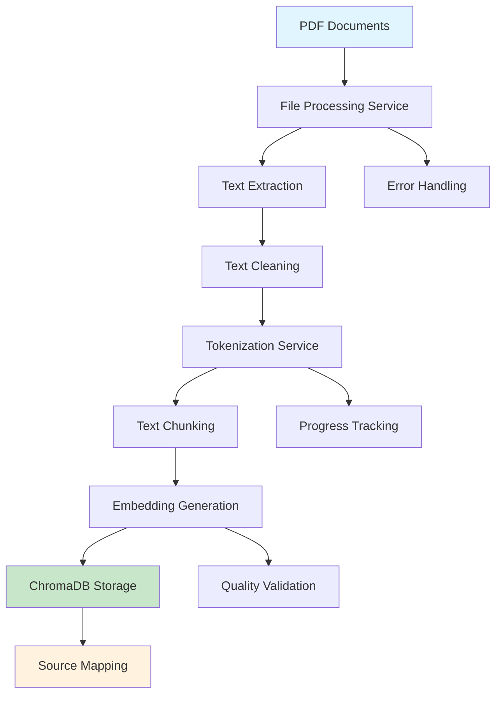

# Data Ingestion Flow

## Overview

The data ingestion flow is the process of converting raw PDF documents into searchable vector embeddings stored in ChromaDB. This pipeline transforms unstructured documents into a format that enables efficient semantic search and retrieval for the RAG system.

## Flow Diagram



## Step-by-Step Process

### 1. Document Input

**Input**: PDF documents placed in the processing directory
**Location**: `Data/unprocessed_files/`

**Supported Formats**:
- PDF files (primary format)
- Text files (direct processing)
- Future: DOCX, RTF, HTML

**File Requirements**:
- Readable text content (not image-only PDFs)
- UTF-8 compatible characters
- File size < 100MB (configurable)

### 2. File Processing Service

**Service**: `FileProcessingService`
**Purpose**: Convert PDFs to clean text

#### 2.1 PDF to Text Conversion

```python
# Extract text from PDF using PyMuPDF
with fitz.open(pdf_path) as doc:
    text_parts = []
    for page in doc:
        text_parts.append(page.get_text())
    text = "".join(text_parts)
```

**Process**:
1. **File Validation**: Check file exists and is PDF format
2. **PDF Opening**: Use PyMuPDF to open document
3. **Page Iteration**: Extract text from each page
4. **Text Concatenation**: Combine all page text
5. **File Writing**: Save as UTF-8 encoded .txt file

**Output**: Raw text files in `Data/raw_txt_files/`

#### 2.2 Text Cleaning

```python
def clean_text(text: str) -> str:
    # Remove lines with only numbers
    text = re.sub(r'^\s*\d+\s*$', '', text, flags=re.MULTILINE)
    # Collapse multiple newlines
    text = re.sub(r'\n+', '\n', text)
    # Collapse multiple spaces
    text = re.sub(r'[ ]{2,}', ' ', text)
    # Strip lines and remove empty lines
    text = '\n'.join(line.strip() for line in text.split('\n') if line.strip())
    # Make single paragraph
    text = text.replace('\n', ' ')
    return text.strip()
```

**Cleaning Steps**:
1. **Remove Page Numbers**: Delete lines containing only digits
2. **Normalize Whitespace**: Collapse multiple spaces and newlines
3. **Strip Lines**: Remove leading/trailing whitespace
4. **Remove Empty Lines**: Filter out blank lines
5. **Paragraph Formation**: Join lines into continuous text

**Output**: Cleaned text files in `Data/cleaned_txt_files/`

### 3. Tokenization Service

**Service**: `TokenizationService`
**Purpose**: Chunk text and generate embeddings

#### 3.1 Text Chunking

```python
def split_into_chunks_by_tokens(
    self,
    text: str,
    max_tokens: int = 512,
    overlap: int = 50
) -> List[str]:
    tokens = self.tokenizer.encode(text, add_special_tokens=False)
    chunks = []
    
    for i in range(0, len(tokens), max_tokens - overlap):
        chunk_tokens = tokens[i:i + max_tokens]
        chunk_text = self.tokenizer.decode(chunk_tokens, skip_special_tokens=True)
        chunks.append(chunk_text)
    
    return chunks
```

**Chunking Strategy**:
- **Token-Based**: Use tokenizer to respect word boundaries
- **Overlap**: 50 tokens overlap between chunks for context continuity
- **Size**: 512 tokens per chunk (configurable)
- **Boundary Respect**: Don't break words or sentences mid-way

**Benefits**:
- Maintains semantic coherence
- Enables precise context retrieval
- Optimizes for LLM context windows

#### 3.2 Embedding Generation

```python
def generate_embeddings(self, texts: List[str]) -> torch.Tensor:
    embeddings = self.embedding_model.encode(
        texts,
        convert_to_tensor=True,
        show_progress_bar=self.progress
    )
    return embeddings
```

**Embedding Process**:
1. **Model Loading**: Load sentence-transformers model
2. **Batch Processing**: Process chunks in batches for efficiency
3. **Vector Generation**: Convert text to high-dimensional vectors
4. **Normalization**: Optional L2 normalization for similarity search

**Model Details**:
- **Model**: `sentence-transformers/all-MiniLM-L6-v2`
- **Dimensions**: 384-dimensional vectors
- **Performance**: Optimized for semantic similarity
- **Language**: Multi-language support

### 4. ChromaDB Storage

**Service**: `ChromaDBClient`
**Purpose**: Store and index embeddings for retrieval

#### 4.1 Collection Management

```python
def initialize(self, db_path: Path, collection_name: str):
    self._client = chromadb.PersistentClient(path=str(db_path))
    self._collection = self._create_or_get_collection(collection_name)
```

**Storage Structure**:
```
chroma_db/
├── hr_policies/           # HR policy collection
│   ├── embeddings/       # Vector embeddings
│   ├── documents/        # Text chunks
│   └── metadata/         # Source information
└── merchant_faqs/        # Merchant FAQ collection
    ├── embeddings/
    ├── documents/
    └── metadata/
```

#### 4.2 Data Insertion

```python
def add_documents(
    self,
    documents: List[str],
    embeddings: List[List[float]],
    metadatas: List[Dict]
):
    self._collection.add(
        documents=documents,
        embeddings=embeddings,
        metadatas=metadatas
    )
```

**Metadata Structure**:
```json
{
  "source_file": "employee_handbook.pdf",
  "chunk_index": 5,
  "page_number": 3,
  "section": "Travel Policy",
  "created_at": "2024-01-15T10:30:00Z"
}
```

### 5. Source Mapping

**Purpose**: Maintain traceability between chunks and original documents

#### 5.1 Mapping Creation

```python
def create_source_map(
    self,
    chunks: List[str],
    source_file: str
) -> Dict:
    return {
        "source_file": source_file,
        "total_chunks": len(chunks),
        "chunk_mapping": {
            i: {
                "text": chunk,
                "token_count": len(self.tokenizer.encode(chunk)),
                "embedding_index": i
            }
            for i, chunk in enumerate(chunks)
        }
    }
```

**Mapping Benefits**:
- **Traceability**: Link responses back to source documents
- **Citation**: Provide source information in responses
- **Debugging**: Easily locate problematic chunks
- **Updates**: Efficiently update specific document sections

## Complete Pipeline Example

```python
async def ingest_document(pdf_path: str):
    # 1. File Processing
    file_service = FileProcessingService()
    txt_files = await file_service.pdf_to_txt([pdf_path])
    cleaned_files = await file_service.write_cleaned_txt_file(txt_files)
    
    # 2. Tokenization and Embedding
    token_service = TokenizationService()
    
    for cleaned_file in cleaned_files:
        with open(cleaned_file, 'r') as f:
            text = f.read()
            
        # Chunk the text
        chunks = await token_service.split_into_chunks_by_tokens(text)
        
        # Generate embeddings
        embeddings = await token_service.generate_embeddings(chunks)
        
        # 3. Store in ChromaDB
        chroma_client = get_chroma_client()
        
        metadatas = [
            {
                "source_file": pdf_path,
                "chunk_index": i,
                "created_at": datetime.now().isoformat()
            }
            for i in range(len(chunks))
        ]
        
        chroma_client.add_documents(
            documents=chunks,
            embeddings=embeddings.tolist(),
            metadatas=metadatas
        )
        
        # 4. Create source mapping
        source_map = token_service.create_source_map(chunks, pdf_path)
        token_service.save_source_map(source_map, f"{pdf_path}_map.json")
```

## Performance Optimization

### Batch Processing

```python
# Process multiple documents efficiently
async def batch_ingest(pdf_paths: List[str]):
    # Process files in parallel
    file_tasks = [file_service.pdf_to_txt([path]) for path in pdf_paths]
    txt_results = await asyncio.gather(*file_tasks)
    
    # Generate embeddings in batches
    all_chunks = []
    for txt_files in txt_results:
        for txt_file in txt_files:
            chunks = await token_service.split_into_chunks_by_tokens(
                open(txt_file).read()
            )
            all_chunks.extend(chunks)
    
    # Batch embed
    embeddings = await token_service.generate_embeddings(all_chunks)
```

### Memory Management

- **Streaming**: Process large files without loading entirely into memory
- **Batch Size**: Configurable batch sizes for embedding generation
- **Garbage Collection**: Explicit cleanup of large objects
- **Progress Tracking**: Monitor memory usage during processing

## Quality Assurance

### Validation Steps

1. **Text Quality Check**:
   ```python
   def validate_text_quality(text: str) -> bool:
       return (
           len(text.strip()) > 10 and
           not text.isspace() and
           len(text.split()) > 5
       )
   ```

2. **Embedding Quality Check**:
   ```python
   def validate_embedding(embedding: List[float]) -> bool:
       return (
           len(embedding) == 384 and
           not any(math.isnan(x) for x in embedding) and
           not any(math.isinf(x) for x in embedding)
       )
   ```

3. **Metadata Validation**:
   ```python
   def validate_metadata(metadata: Dict) -> bool:
       required_fields = ["source_file", "chunk_index"]
       return all(field in metadata for field in required_fields)
   ```

### Error Handling

```python
async def robust_ingestion(pdf_path: str):
    try:
        # Process with error handling
        results = await ingest_document(pdf_path)
        
        # Validate results
        if not validate_ingestion_results(results):
            raise ValueError("Ingestion validation failed")
            
        return results
        
    except Exception as e:
        logger.error(f"Ingestion failed for {pdf_path}: {e}")
        # Rollback partial changes
        await rollback_ingestion(pdf_path)
        raise
```

## Monitoring and Logging

### Progress Tracking

```python
class IngestionProgress:
    def __init__(self, total_files: int):
        self.total_files = total_files
        self.processed_files = 0
        self.total_chunks = 0
        self.start_time = time.time()
    
    def update(self, chunks_processed: int):
        self.processed_files += 1
        self.total_chunks += chunks_processed
        
        elapsed = time.time() - self.start_time
        rate = self.processed_files / elapsed
        
        logger.info(f"Progress: {self.processed_files}/{self.total_files} "
                   f"files, {self.total_chunks} chunks, {rate:.2f} files/sec")
```

### Metrics Collection

- **Processing Time**: Time per document and total pipeline
- **Chunk Statistics**: Average chunks per document
- **Embedding Quality**: Vector distribution and quality metrics
- **Storage Usage**: ChromaDB size and performance metrics

## Troubleshooting

### Common Issues

1. **PDF Text Extraction Fails**
   - **Cause**: PDF contains only images or is corrupted
   - **Solution**: Use OCR or manual text extraction

2. **Memory Issues**
   - **Cause**: Large documents or batch size too large
   - **Solution**: Reduce batch size or process documents individually

3. **Embedding Generation Fails**
   - **Cause**: Model download issues or GPU memory
   - **Solution**: Check internet connection and reduce batch size

4. **ChromaDB Storage Issues**
   - **Cause**: Disk space or permission issues
   - **Solution**: Check disk space and file permissions

### Debug Mode

Enable detailed logging for troubleshooting:

```python
import logging
logging.basicConfig(level=logging.DEBUG)

# Enable progress bars
token_service = TokenizationService(progress=True)

# Detailed error reporting
try:
    await ingest_document("document.pdf")
except Exception as e:
    logger.exception("Detailed error information")
```

## Future Enhancements

### Planned Improvements

1. **Incremental Updates**: Update specific document sections without full re-ingestion
2. **Version Control**: Track document versions and changes
3. **Real-time Processing**: Process documents as they're uploaded
4. **Advanced Chunking**: Semantic chunking based on document structure
5. **Multi-modal Support**: Handle images, tables, and complex layouts

### Performance Optimizations

1. **Distributed Processing**: Process documents across multiple workers
2. **Caching**: Cache embeddings for repeated processing
3. **Compression**: Compress embeddings for storage efficiency
4. **Indexing**: Advanced indexing for faster retrieval
