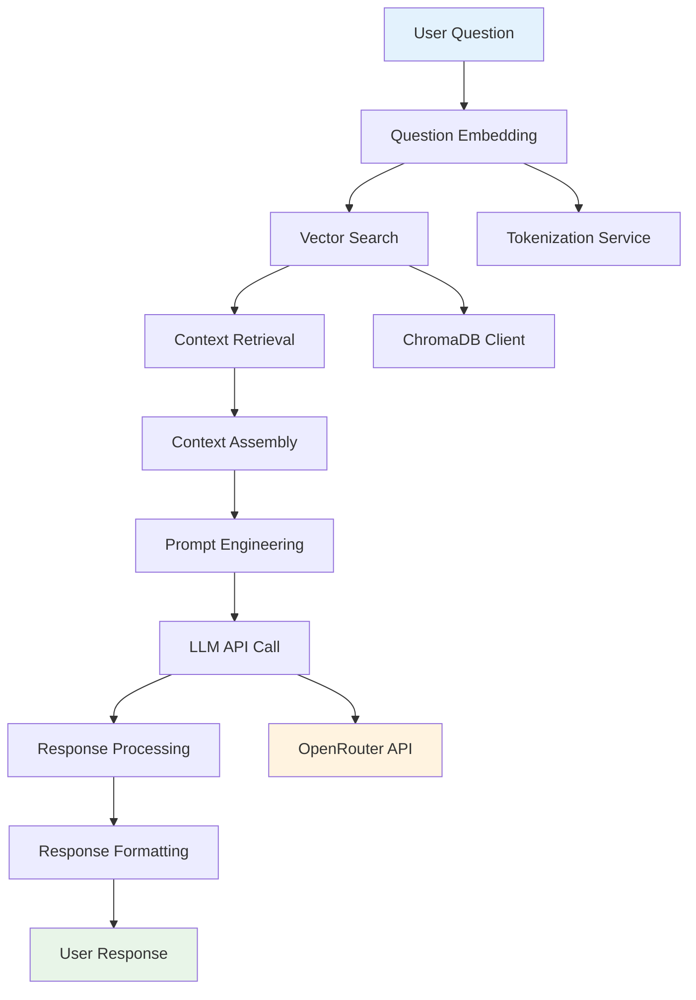

# LLM Querying Flow

## Overview

The LLM Querying Flow is the core process of answering user questions using Retrieval-Augmented Generation (RAG). This pipeline combines semantic search with large language model generation to provide accurate, context-aware responses.

## Flow Diagram



## Step-by-Step Process

### 1. Question Reception

**Input**: User question via API endpoint
**Location**: `POST /ask` or `POST /merchant/ask`

**Request Format**:
```json
{
  "question": "What is the travel policy approval process?",
  "language": "en",
  "max_results": 3
}
```

**Validation**:
- Question length (minimum 3 characters)
- Language support (en/bn)
- Maximum results limit (1-10)

### 2. Question Embedding

**Service**: `TokenizationService`
**Purpose**: Convert question to vector for similarity search

```python
async def embed_question(self, question: str) -> List[float]:
    # Generate embedding for the question
    embedding = self.embedding_model.encode(
        [question],
        convert_to_tensor=True
    )
    return embedding[0].tolist()
```

**Process**:
1. **Text Preprocessing**: Clean and normalize question text
2. **Tokenization**: Convert to tokens using sentence transformers
3. **Embedding Generation**: Create 384-dimensional vector
4. **Normalization**: Optional L2 normalization for consistency

**Model**: `sentence-transformers/all-MiniLM-L6-v2`

### 3. Vector Search

**Service**: `ChromaDBClient`
**Purpose**: Find most similar document chunks

```python
async def get_top_n_query_results(
    self,
    n: int,
    query_embedding: List[float],
    collection_name: str
) -> List[Dict]:
    collection = self._client.get_collection(collection_name)
    
    results = collection.query(
        query_embeddings=[query_embedding],
        n_results=n,
        include=['documents', 'metadatas', 'distances']
    )
    
    return results
```

**Search Process**:
1. **Collection Selection**: Choose appropriate collection (HR policies vs Merchant FAQs)
2. **Similarity Calculation**: Compute cosine similarity between question and all chunks
3. **Ranking**: Sort results by similarity score
4. **Filtering**: Apply relevance thresholds (configurable)

**Parameters**:
- **Top N**: Number of chunks to retrieve (default: 3)
- **Similarity Threshold**: Minimum similarity score (default: 0.5)
- **Collection**: Target collection for search

### 4. Context Retrieval

**Purpose**: Extract and prepare relevant context from search results

```python
async def get_flattened_chunks(
    self,
    chroma_query_results: Dict
) -> List[str]:
    documents = chroma_query_results.get('documents', [[]])
    return documents[0] if documents else []
```

**Context Processing**:
1. **Result Extraction**: Get document chunks from search results
2. **Metadata Extraction**: Extract source information for citations
3. **Quality Filtering**: Remove low-quality or irrelevant chunks
4. **Deduplication**: Remove duplicate or highly similar chunks

**Output Format**:
```python
[
    "According to the Employee Travel and Transfer Guideline...",
    "The approval process requires manager approval within 48 hours...",
    "Travel requests must be submitted through the HR portal..."
]
```

### 5. Context Assembly

**Service**: `TokenizationService`
**Purpose**: Prepare context for LLM consumption

```python
async def prepare_llm_context(
    self,
    flat_chunks: List[str]
) -> str:
    if not flat_chunks:
        return ""
    
    # Join chunks with separators
    context = "\n\n".join(flat_chunks)
    
    # Truncate if too long (respect LLM context limits)
    max_context_length = 3000  # tokens
    if len(self.tokenizer.encode(context)) > max_context_length:
        context = self.tokenizer.decode(
            self.tokenizer.encode(context)[:max_context_length],
            skip_special_tokens=True
        )
    
    return context
```

**Assembly Strategy**:
- **Chunk Joining**: Combine chunks with clear separators
- **Context Length**: Respect LLM context window limits
- **Quality Preservation**: Maintain semantic coherence
- **Source Tracking**: Preserve metadata for citations

### 6. Prompt Engineering

**Service**: `LLMQueryingService`
**Purpose**: Create optimized prompts for LLM

```python
def format_prompt(
    self,
    context: str,
    question: str,
    language: str = "en"
) -> List[Dict]:
    system_prompt = self.get_system_prompt(language)
    
    if context and context.strip():
        user_prompt = f"""
        Answer in {language} language. bn is for bengali. en is for english.
        
        Based on the following context:
        {context}
        
        Question: {question}
        
        Answer:"""
    else:
        user_prompt = question
    
    return [
        {"role": "system", "content": system_prompt},
        {"role": "user", "content": user_prompt}
    ]
```

**Prompt Components**:

#### System Prompt (HR Policies)
```
You are a helpful assistant for bKash HR policies. Your role is to provide accurate 
answers based on the provided context documents. Always answer in the requested 
language and cite sources when possible. If the information is not in the context, 
say "I don't have information about that in the provided documents."
```

#### System Prompt (Merchant FAQs)
```
আপনি একজন সহায়ক অ্যাসিস্ট্যান্ট, যিনি কেবলমাত্র bKash মার্চেন্টদের জন্য কাজ করেন।
আপনার কাজ হলো মার্চেন্ট সম্পর্কিত প্রশ্নগুলোর উত্তর সঠিকভাবে এবং সংক্ষেপে দেওয়া,
এবং কেবলমাত্র সরবরাহ করা কনটেক্সট ডকুমেন্ট ব্যবহার করে উত্তর দিতে হবে।
```

**Prompt Optimization**:
- **Language Specification**: Clear language instructions
- **Context Integration**: Structured context presentation
- **Answer Format**: Consistent response formatting
- **Source Citation**: Instructions for source attribution

### 7. LLM API Call

**Service**: `LLMQueryingService`
**Purpose**: Generate response using external LLM

```python
async def api_call_with_context(
    self,
    context: str,
    question: str,
    language: str = "en"
) -> str:
    # Prepare messages
    messages = self.format_prompt(context, question, language)
    
    # API request payload
    payload = {
        "model": self.LLM_MODEL_NAME,
        "messages": messages,
        "temperature": 0.0,  # Keep temperature low for factual answers
        "max_tokens": 300    # Limit response length
    }
    
    # Make API call
    response = requests.post(
        self.LLM_API_BASE_URL,
        headers=self.get_headers(),
        json=payload
    )
    
    response.raise_for_status()
    result = response.json()
    
    return result['choices'][0]['message']['content'].strip()
```

**API Configuration**:
- **Provider**: OpenRouter
- **Model**: `openai/gpt-4.1` (configurable)
- **Temperature**: 0.0 (deterministic responses)
- **Max Tokens**: 300 (concise responses)
- **Timeout**: 30 seconds

**Error Handling**:
- **Rate Limiting**: Exponential backoff for rate limits
- **Network Errors**: Retry with increasing delays
- **API Errors**: Graceful degradation with error messages
- **Timeout**: Configurable timeout handling

### 8. Response Processing

**Purpose**: Validate and enhance LLM response

```python
def process_response(
    self,
    raw_response: str,
    source_metadata: List[Dict]
) -> Dict:
    # Validate response
    if not raw_response or len(raw_response.strip()) < 10:
        raise ValueError("Invalid or empty response from LLM")
    
    # Extract source information
    sources = [
        {
            "source_file": meta.get("source_file", "Unknown"),
            "chunk_index": meta.get("chunk_index", 0),
            "similarity_score": meta.get("distance", 0.0)
        }
        for meta in source_metadata
    ]
    
    return {
        "answer": raw_response.strip(),
        "sources": sources,
        "confidence": self.calculate_confidence(sources)
    }
```

**Processing Steps**:
1. **Response Validation**: Check for valid, non-empty responses
2. **Source Attribution**: Link response to source documents
3. **Confidence Calculation**: Estimate answer confidence
4. **Quality Assessment**: Evaluate response quality

### 9. Response Formatting

**Purpose**: Format final response for API consumption

```python
def format_api_response(
    self,
    processed_response: Dict,
    processing_time: float
) -> Dict:
    return {
        "answer": processed_response["answer"],
        "source_metadata": processed_response["sources"],
        "processing_time": processing_time,
        "model_used": self.LLM_MODEL_NAME,
        "confidence": processed_response["confidence"]
    }
```

**Response Format**:
```json
{
  "answer": "According to the Employee Travel and Transfer Guideline...",
  "source_metadata": [
    {
      "source_file": "Employee Travel and Transfer Guideline_cleaned.txt",
      "chunk_index": 12,
      "similarity_score": 0.89
    }
  ],
  "processing_time": 1.23,
  "model_used": "openai/gpt-4.1",
  "confidence": 0.85
}
```

## Complete Pipeline Example

```python
async def answer_question(question: str, language: str = "en"):
    start_time = time.time()
    
    try:
        # 1. Generate question embedding
        token_service = TokenizationService()
        question_embedding = await token_service.embed_question(question)
        
        # 2. Search for relevant context
        chroma_client = get_chroma_client()
        search_results = await chroma_client.get_top_n_query_results(
            n=3,
            query_embedding=question_embedding,
            collection_name="hr_policies"
        )
        
        # 3. Extract and prepare context
        chunks = await chroma_client.get_flattened_chunks(search_results)
        context = await token_service.prepare_llm_context(chunks)
        
        # 4. Generate LLM response
        llm_service = LLMQueryingService()
        raw_response = await llm_service.api_call_with_context(
            context=context,
            question=question,
            language=language
        )
        
        # 5. Process and format response
        processing_time = time.time() - start_time
        
        response = {
            "answer": raw_response,
            "source_metadata": extract_source_metadata(search_results),
            "processing_time": processing_time,
            "model_used": llm_service.LLM_MODEL_NAME
        }
        
        return response
        
    except Exception as e:
        logger.error(f"Error processing question: {e}")
        raise
```

## Performance Optimization

### Caching Strategy

```python
class ResponseCache:
    def __init__(self, max_size: int = 1000):
        self.cache = {}
        self.max_size = max_size
    
    def get_cache_key(self, question: str, language: str) -> str:
        return f"{question.lower().strip()}:{language}"
    
    def get(self, question: str, language: str) -> Optional[Dict]:
        key = self.get_cache_key(question, language)
        return self.cache.get(key)
    
    def set(self, question: str, language: str, response: Dict):
        key = self.get_cache_key(question, language)
        
        if len(self.cache) >= self.max_size:
            # Remove oldest entry
            oldest_key = next(iter(self.cache))
            del self.cache[oldest_key]
        
        self.cache[key] = response
```

### Batch Processing

```python
async def batch_answer_questions(questions: List[str]):
    # Generate embeddings for all questions
    token_service = TokenizationService()
    embeddings = await token_service.generate_embeddings(questions)
    
    # Batch search for all questions
    chroma_client = get_chroma_client()
    all_results = []
    
    for embedding in embeddings:
        results = await chroma_client.get_top_n_query_results(
            n=3,
            query_embedding=embedding.tolist(),
            collection_name="hr_policies"
        )
        all_results.append(results)
    
    # Process responses
    responses = []
    for i, question in enumerate(questions):
        context = prepare_context(all_results[i])
        response = await generate_response(question, context)
        responses.append(response)
    
    return responses
```

## Quality Assurance

### Response Validation

```python
def validate_response(response: str, context: str) -> bool:
    # Check response length
    if len(response.strip()) < 10:
        return False
    
    # Check for hallucination (response not supported by context)
    if context and not is_supported_by_context(response, context):
        return False
    
    # Check for appropriate language
    if not is_appropriate_language(response):
        return False
    
    return True

def is_supported_by_context(response: str, context: str) -> bool:
    # Simple keyword matching (can be enhanced with more sophisticated methods)
    response_keywords = extract_keywords(response.lower())
    context_keywords = extract_keywords(context.lower())
    
    # Check if key concepts from response appear in context
    key_concepts = [kw for kw in response_keywords if len(kw) > 3]
    supported_concepts = sum(1 for concept in key_concepts 
                           if concept in context_keywords)
    
    return supported_concepts / len(key_concepts) > 0.5
```

### Confidence Scoring

```python
def calculate_confidence(
    self,
    source_metadata: List[Dict]
) -> float:
    if not source_metadata:
        return 0.0
    
    # Calculate confidence based on similarity scores
    similarity_scores = [
        1 - meta.get("distance", 1.0)  # Convert distance to similarity
        for meta in source_metadata
    ]
    
    # Weight by relevance (top results get higher weight)
    weights = [1.0, 0.7, 0.5][:len(similarity_scores)]
    
    weighted_score = sum(score * weight for score, weight in zip(similarity_scores, weights))
    total_weight = sum(weights)
    
    return weighted_score / total_weight if total_weight > 0 else 0.0
```

## Error Handling

### Graceful Degradation

```python
async def robust_question_answering(question: str, language: str = "en"):
    try:
        # Try full RAG pipeline
        return await answer_question(question, language)
        
    except Exception as e:
        logger.error(f"RAG pipeline failed: {e}")
        
        # Fallback to direct LLM response
        try:
            llm_service = LLMQueryingService()
            fallback_response = await llm_service.api_call_with_context(
                context="",
                question=question,
                language=language
            )
            
            return {
                "answer": fallback_response,
                "source_metadata": [],
                "processing_time": 0.0,
                "model_used": llm_service.LLM_MODEL_NAME,
                "fallback": True
            }
            
        except Exception as fallback_error:
            logger.error(f"Fallback also failed: {fallback_error}")
            
            # Return error response
            return {
                "answer": "I'm sorry, I'm unable to process your question at the moment. Please try again later.",
                "source_metadata": [],
                "processing_time": 0.0,
                "model_used": "none",
                "error": True
            }
```

### Rate Limiting

```python
class RateLimiter:
    def __init__(self, max_requests: int = 100, window: int = 60):
        self.max_requests = max_requests
        self.window = window
        self.requests = []
    
    async def check_rate_limit(self) -> bool:
        now = time.time()
        
        # Remove old requests
        self.requests = [req for req in self.requests if now - req < self.window]
        
        if len(self.requests) >= self.max_requests:
            return False
        
        self.requests.append(now)
        return True
```

## Monitoring and Analytics

### Performance Metrics

```python
class QueryMetrics:
    def __init__(self):
        self.total_queries = 0
        self.successful_queries = 0
        self.failed_queries = 0
        self.average_response_time = 0.0
        self.cache_hit_rate = 0.0
    
    def record_query(self, success: bool, response_time: float, cache_hit: bool):
        self.total_queries += 1
        
        if success:
            self.successful_queries += 1
        else:
            self.failed_queries += 1
        
        # Update average response time
        self.average_response_time = (
            (self.average_response_time * (self.total_queries - 1) + response_time) 
            / self.total_queries
        )
        
        # Update cache hit rate
        if cache_hit:
            self.cache_hit_rate = self.successful_queries / self.total_queries
```

### Query Logging

```python
def log_query(
    question: str,
    response: Dict,
    processing_time: float,
    user_id: Optional[str] = None
):
    log_entry = {
        "timestamp": datetime.now().isoformat(),
        "question": question,
        "response_length": len(response.get("answer", "")),
        "processing_time": processing_time,
        "model_used": response.get("model_used"),
        "confidence": response.get("confidence", 0.0),
        "sources_count": len(response.get("source_metadata", [])),
        "user_id": user_id
    }
    
    logger.info(f"Query processed: {log_entry}")
```

## Future Enhancements

### Planned Improvements

1. **Multi-Modal Support**: Handle images and documents with visual content
2. **Conversation Memory**: Maintain context across multiple questions
3. **Personalization**: Adapt responses based on user preferences
4. **Advanced Caching**: Semantic caching for similar questions
5. **Real-time Learning**: Update knowledge base from user feedback

### Performance Optimizations

1. **Vector Search Optimization**: Advanced indexing for faster retrieval
2. **Response Streaming**: Stream responses as they're generated
3. **Model Optimization**: Quantization and optimization for faster inference
4. **Distributed Processing**: Scale across multiple servers
